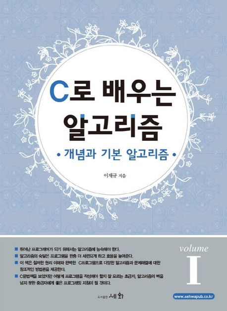
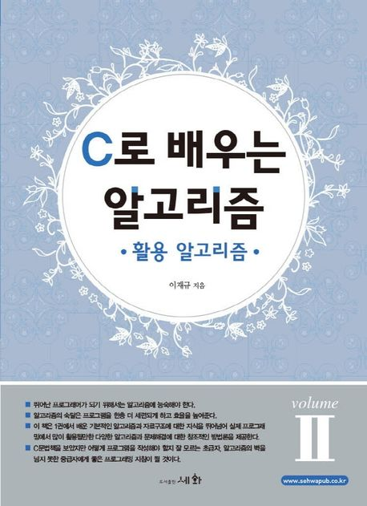

# calgo_1994
This is a collection of source codes from the book "C로 배우는 알고리즘 1, 2", published in 1994 and 1996.

이 소스코드들은 1994년에 출간된 [C로 배우는 알고리즘 1 (개념과 기본 알고리즘)](https://search.shopping.naver.com/book/catalog/32466577760?query=C%EB%A1%9C%20%EB%B0%B0%EC%9A%B0%EB%8A%94%20%EC%95%8C%EA%B3%A0%EB%A6%AC%EC%A6%981&NaPm=ct%3Dmlsxnsxc%7Cci%3D7c2052bbaf77b01539982c3923d4177df1c609a5%7Ctr%3Dboksl%7Csn%3D95694%7Chk%3D32a26daf1df9f36f4b0da108d5b697505adfa7c5)과 1996년에 출간된 [C로 배우는 알고리즘 2 (활용 알고리즘)](https://search.shopping.naver.com/book/catalog/32466841391?query=C%EB%A1%9C%20%EB%B0%B0%EC%9A%B0%EB%8A%94%20%EC%95%8C%EA%B3%A0%EB%A6%AC%EC%A6%98%202&NaPm=ct%3Dmlsxp3zs%7Cci%3D6e993ba5a2a12c651643db9d0072c3090193b1f8%7Ctr%3Dboksl%7Csn%3D95694%7Chk%3D476db9dbc3cf86cc3121ce940e0e8ba6f4567e40)에 수록된 것을 편리하게 볼 수 있도록 공개한 것입니다. 

1990년대 작성된 C 코드여서 당시 주로 사용되던 Borland의 Turbo C로 작성되었으며, MS-DOS 환경에서 제대로 작동합니다. 
현대적인 환경에서 컴파일 및 실행하려면 코드의 수정이 필요합니다. 

가끔 이 책들의 소스코드를 요청하시는 분들이 계셔서 올려 놓습니다. 

비슷한 컨텐츠로 [C++로 배우는 알고리즘](https://github.com/leejaku17/cppalgo_2002)도 있으니 참고 바랍니다. 

